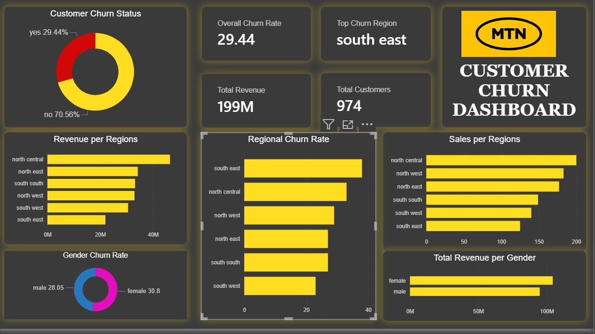
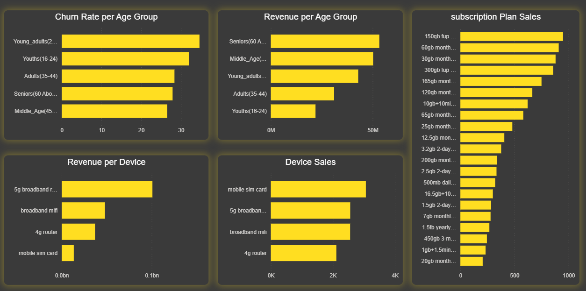
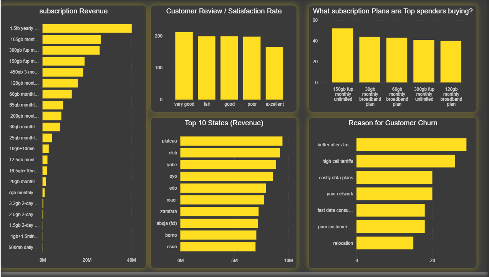

  
  
    

## welcome

mtn_churn_report.md contains the the full report.  

Summary.md contains the summary and key insights.  

The pandas script is contained inside the .ipynb file.  

The SQL sccript is contained inside the the .SQL file.  

Happy Navigation.  

Your Feedback is most welcome.
