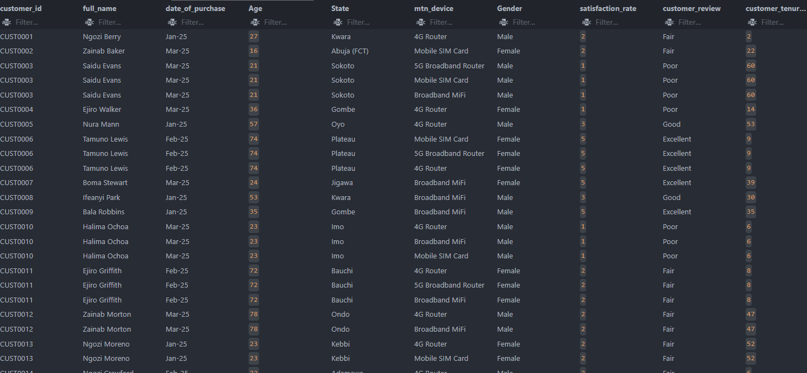
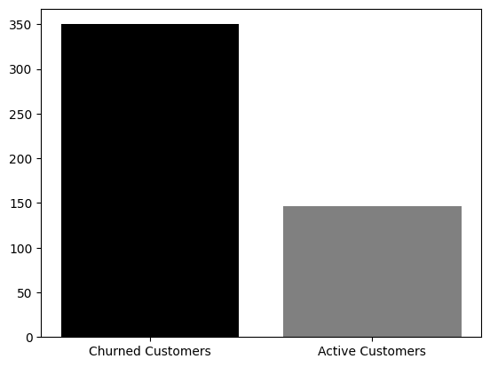
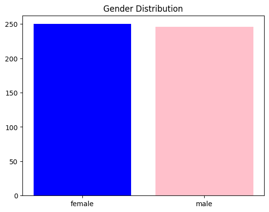
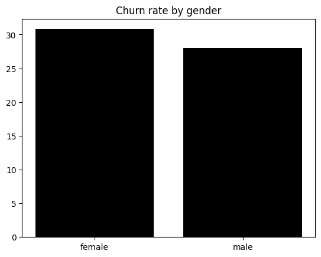
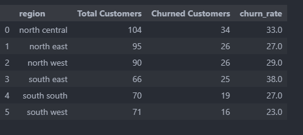
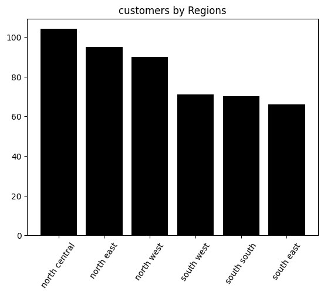
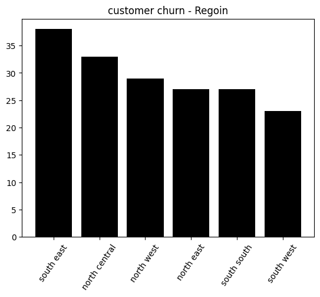

# MTN CHURN ANALYSIS REPORT

## BUSINESS PROBLEM

    This project aims to Analyse  the usage patterns of mtn products in Nigeria, customer churn and and create insights on customer retention, product performance and revenue optimization

## DATA SET OVERVIEW

    - Total Records: 974
    - Unique Customers: 496
    - Period: One Year
    - Teritory: Nigeria
    - Devices: 4

## KEY COLUMNS

    - Customer ID
    - Age
    - State
    - Gender
    - Customer CHurn Status

## DATA CLEANING

    Data Cleaning was done with python pandas.

## TOOLS AND SKILLS

    - Excel
    - SQL
    - Python
    - Pyplot
    - Business insight

## DATA EXPLORATION

### CUSTOMER BASE

    - Total Unique Customers: 496
    - Total Transaction Volume: 974
    - Total Active customers: 350
    - Total Churned Customers: 146
    - Overall Churn rate: 29.44

    The data presented a 29.44% churn rate which is very high and has resulted in loss of revenue.

#### Gender Distribution

  
  
 The Gender distribution shows an almost equal amount of customers per gender with the female group have just a few numbers higher than the males. While the Number of females were higher, there was a much significant churn of the female customer base with about 30% churn and male about 28%.

#### Regional Customer Analysis

  
  

The North central recorded the highest volume of customers while the south east had the least. However, the south east recorded the highest customer churn followed by North central. This signifies possible low customer satisfaction in the south east or lack of adequate marketing which leads to customers moving to competitors products.
