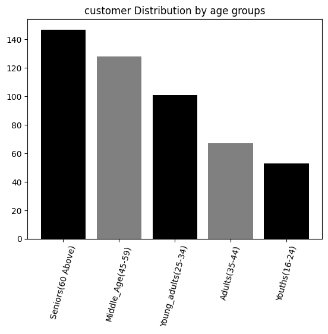
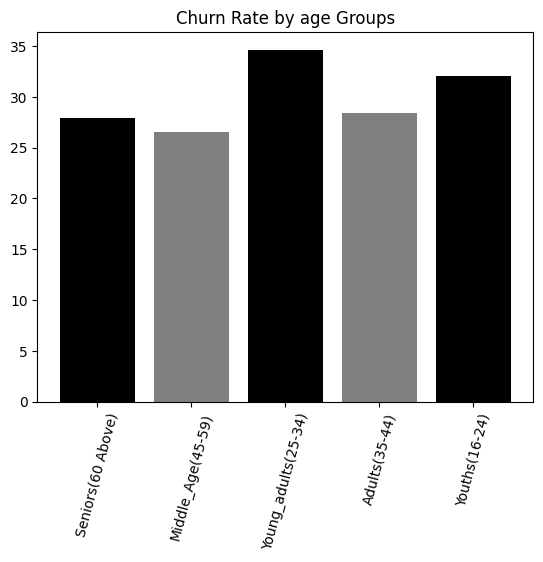
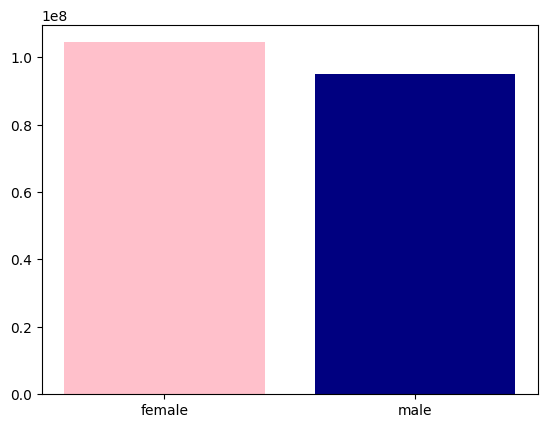
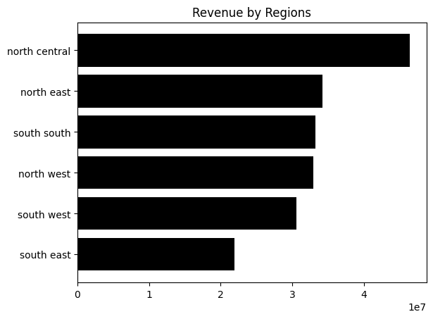
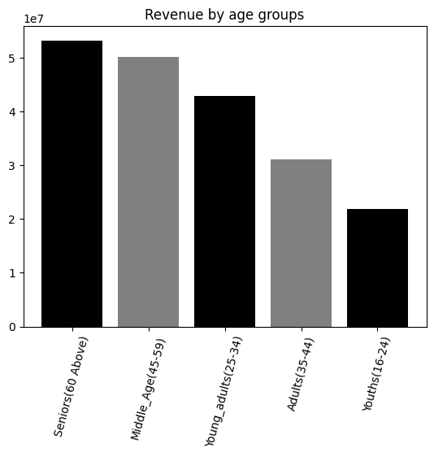
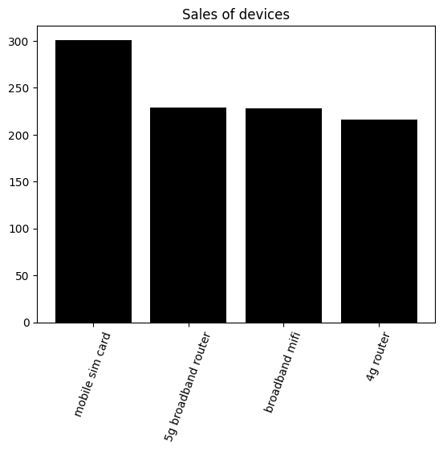
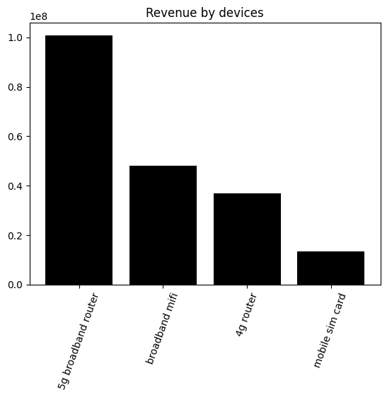
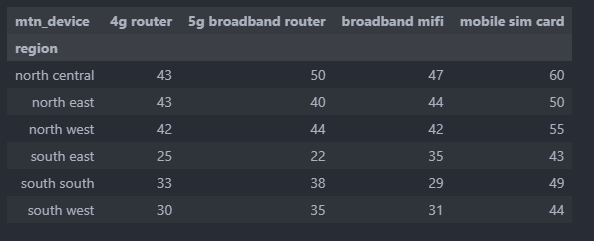
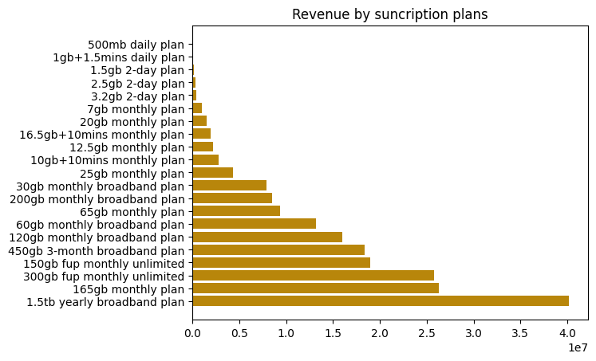
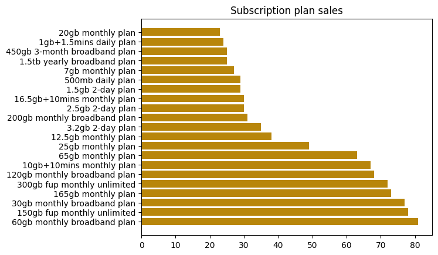

# MTN CHURN ANALYSIS REPORT

## BUSINESS PROBLEM

    This project aims to Analyse  the usage patterns of mtn products in Nigeria, customer churn and and create insights on customer retention, product performance and revenue optimization

## DATASET OVERVIEW

    - Total Records: 974
    - Unique Customers: 496
    - Period: One Year
    - Teritory: Nigeria
    - Devices: 4

## KEY COLUMNS

    - Customer ID
    - Age
    - State
    - Gender
    - Customer CHurn Status

## DATA CLEANING

    Data Cleaning was done with python pandas.

## TOOLS AND SKILLS

    - Excel
    - SQL
    - Python
    - Pyplot
    - Business insight

## DATA EXPLORATION

## CUSTOMER BASE AND CHURN

    - Total Unique Customers: 496
    - Total Transaction Volume: 974
    - Total Active customers: 350
    - Total Churned Customers: 146
    - Overall Churn rate: 29.44

    The data presented a 29.44% churn rate which is very high and has resulted in loss of revenue.

#### Gender Distribution

  
  
 The Gender distribution shows an almost equal amount of customers per gender with the female group have just a few numbers higher than the males. While the Number of females were higher, there was a much significant churn of the female customer base with about 30% churn and male about 28%.

#### Regional Customer Analysis

  
  

The North central recorded the highest volume of customers while the south east had the least. However, the south east recorded the highest customer churn followed by North central. This signifies possible low customer satisfaction in the south east or lack of adequate marketing which leads to customers moving to competitors products. The South West recorded the lowest churn rate and number 4 in total customer base signifying better service presence and a potential market for growth.

#### Age Groups

    The data was further grouped into 5 age groups to understand the spending habits of the different age group and how much of each age we have in our data.

  

The Data shows that a significant portion(29%) of the customer base are Senior citizens of 60 years old and above, followed by the middle aged people. The data further shows that the acceptance of our services goes down as the different ages go down, with younger people with just a 10% share of the customer base.
The churn pattern also shows that the younf adults had the highest churn rate of about 34% followed by the youths. Efforts must be made to undestand the preferences of these groups to enable us penetrate the market.
we mst also ensure to carry out survery to understand why we have more of the snr citizens using our products and less of the younger people. A dive into the reason for churn shows relocation being the most reason, while customer satisfaction among them seems to be low as more than 58% percent of the youths scored our services between 1(poor) and 2(fair).

## REVENUE

    Total Revenue: 199,348,200

### Revenue BY Gender

  

    The Revenue generation from the gender analysis shows a higher revenue generation from the female than the men. female generates about 52% of the total revenue while having about 50.4% of the total customer base.
    This signifies a higher purchasing rate from women.

### Revenue by Region

    Data from revenue shows the North Central leading the revenue generation followed by the North and The south East being the lowest as seeen in the customer distribution. The South South however genertated more revenue than the South West and North west which had more customers - this shows a higher premium purchase from the region.

    Whille the North Central Tops the List of customers and Revenue, Only Platue State from the region features in the top 5 revenue generating states with another 2 featuring in the top 10; Only one North Central State features in the bottom 10.

    The South East states neither featured in the top 10 or bottom 10 states.

### Revenue By Age Groups

  
 We dived in to know which age group of customers generates the most revenue.
REneveue Generation correlates with the customer distribution. with most of the revenue from the senior citizens coming down with age as the Youths have the lowest.

    Eforts should be made to improve in this as the current tech savvy youths and young adults have more demand and access to the internet and should have the highest market share. This current situation is costing the organisation serious losses and we have an untapped market.

### Revenue From Devices

  

The most Revenue came from the 5g broadband router which generated more than twice the second on the revenue list (Broad band MIFI). However on the scale of sales, the most sold device was the mobile simcard followed by the 5g router.

The revenue discripancy with the sales is as a result of the unit price as the 5g is more expensive than the others.

Production cost data needs to be provided to enable us determine which product is more profitable regardless of the sales and revenue reported.

  
The various regions do not show any major differences in thier choices of device except for the south east which displayed a very low patronage for the 5g broadband router and 4g router, suggesting a possible lower purchasing power of current customers

### Revenue from Sunscription Plans

  
The 1.5tb yearly broad band plan generated the most revenue. This is reasonable as the most reasonable as the leading devices are boradband devices.

For sales volume, the 1.5tb plan sold only 25 units, with the 60gb monthly broadband plan leading the sales chat.
The 1.5tb plan may have fetched the highest revenue, however, the sales is very; this may be due to afforfability.

    - A quick look at what the top spenders are buying (*Middle age and Senior*)

  
Those who spent the most money bought the above subscription plans

    - A quick look at what the bottom spenders are buying (**Middle age and Senior**)

  
Those who spent the least bought the following Subscription plans

## CUSTOMER REVIEW

  
The customer Review is not entirely impressive with the average rating being 3 out of 5.
Among the churned customers, the satisfaction rate remains almost the same for all customers with just a significant increase in the number of customers who scored 4 and 5.

Satisfaction may not be a leading cause of customer churn, but efforts must be made to keep the satisfaction rate Elevated to ensure customer retention.

## CUSTOMER CHURN REASON

  
Data from the churn reason shows the major reason why customers leave us due to better offer from customers citing afordability challenges. This is followed still by high call tarriffs which will also explain better offers from customers.

Poor network also features high alongside costly data plans and poor customer service.

Efforts should be made to improve to restructure the data plans to meet the reality of the market demand.

## KEY INSIGHTS AND SUMMARY: [Summary](SUMMARY.md)

# DATA EXPLORATION

- SQL File: [SQL](mtn_churn.sql)
- Python File: [Python](mtn_churn.ipynb)
- DataSet: [csv](mtn_churn_csv.csv)

## Author

**Nnaemeka Ijeoma**
